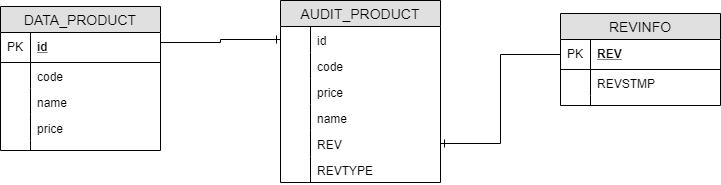

# Spring Boot + Hibernate Envers

## Prerequisites:
- Java 8
- Maven

## Database:
- Apache Derby

### Database Schema

## Example Rest API:
- POST - http://localhost:8888/save : {"code": "P1","name": "Pepsi","price": 10.00}
- POST - http://localhost:8888/list
- POST - http://localhost:8888/update : {"id":1,"code": "C2","name": "Coke","price": 12.12}
- GET - http://localhost:8888/getProductById/1
- GET - http://localhost:8888/deleteById/1
- GET - http://localhost:8888/getProductRevisionsById/1

### Blog
[Spring Boot + JPA (Hibernate) Envers]: https://medium.com/@sarun.wn/spring-boot-jpa-hibernate-envers-53d54131e365?source=friends_link&sk=a9f921bee3aedfdd9ec909d9224a342b
[Spring Boot + JPA (Hibernate) Envers]
